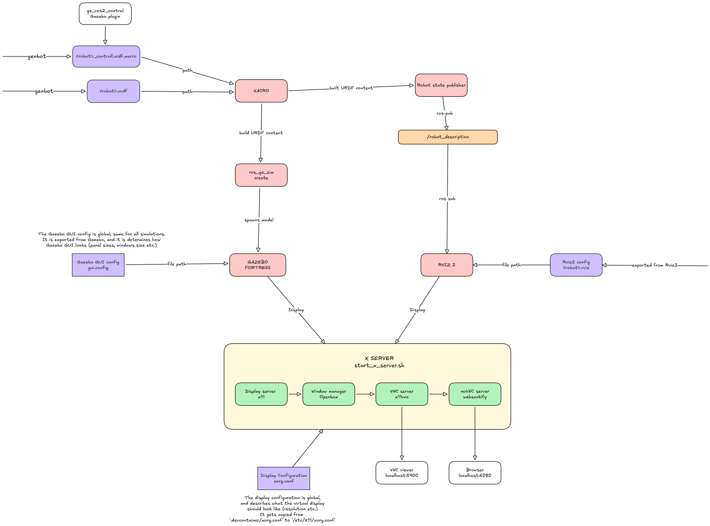

## Package structure

All ROS 2 packages live in the `robot-sim/` directory. Every directory containing a `package.xml` is a package.

### Robot packages

Each robot has two packages, generated by [genbot](./genbot/):

**`<robot>_description`** -- the robot model
- `urdf/<robot>.urdf` -- geometry URDF (positions, links, joints, mesh references)
- `urdf/<robot>_control.urdf.xacro` -- `ros2_control` hardware interface block (joints, command/state interfaces)
- `meshes/` -- STL mesh files from OnShape
- Built with `ament_cmake` -- `CMakeLists.txt` installs URDFs and meshes to the share directory

**`<robot>_bringup`** -- launch configuration
- `launch/<robot>.launch.py` -- orchestrates the full simulation startup
- `config/<robot>.controller.yaml` -- controller manager config (joints, update rate, controller types)
- `config/<robot>.rviz` -- RViz visualization layout
- Built with `ament_cmake`

### Shared packages

**`sim_common`** -- shared Python utilities
- `launch_utils.py` -- helper functions for launch files (`get_asset()` resolves paths in package share directories)
- `move_joints.py` -- ROS 2 node for sending one-shot joint trajectory commands
- `joint_gui.py` -- Tkinter GUI for interactive joint control
- Built with `ament_python` (`setup.py` + `setup.cfg`)
- Registers `move_joints` and `joint_gui` as console script entry points

**`sim_worlds`** -- Gazebo world files
- `worlds/empty.world.sdf` -- default world with physics, lighting, and a ground plane
- `gui/gui.config` -- Gazebo GUI plugin layout
- Built with `ament_cmake`

## Building

The `launch_sim.sh` script handles building automatically. To build manually:

```bash title="Inside devcontainer"
cd robot-sim
colcon build --packages-up-to arm_bringup arm_description sim_worlds sim_common \
    --cmake-args -DBUILD_TESTING=OFF
source install/setup.bash
```

`--packages-up-to` ensures all dependencies are resolved and built in the correct order. The `install/setup.bash` overlay lets ROS 2 find the built packages.

### Build outputs

After building, `robot-sim/` contains three generated directories:

| Directory | Contents |
| --- | --- |
| `build/` | Intermediate build artifacts |
| `install/` | Installed packages (what ROS 2 uses at runtime) |
| `log/` | Build logs |

All three are gitignored. Run `./scripts/clean_build.sh` to delete them.

## Adding or modifying packages

When you add or change a package:

1. **`package.xml`** -- declares the package name, version, description, and dependencies. `colcon` uses the `<depend>`, `<build_depend>`, and `<exec_depend>` tags to determine build order.

2. **`CMakeLists.txt`** (CMake packages) -- defines what gets installed to the share directory. Typically installs URDFs, meshes, configs, and launch files.

3. **`setup.py`** (Python packages) -- lists Python modules and console script entry points.

:::tip
If colcon can't find a new package, make sure `package.xml` exists and the package name matches the directory name.
:::

## System flowchart

Here is a flowchart showing how the arm simulation works end-to-end:



## Troubleshooting

**Unexplained build errors:** Run `./scripts/clean_build.sh` and rebuild. This fixes the majority of mysterious failures.

**Package not found at runtime:** Make sure you sourced the workspace (`source install/setup.bash`). Opening a new terminal in VS Code doesn't automatically source it.

**Dependency order issues:** Check that all `<depend>` tags in `package.xml` are correct. Missing dependencies cause packages to build before their dependencies are ready.
