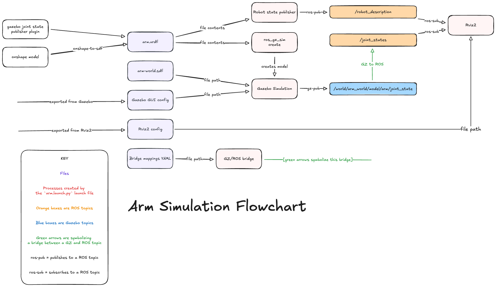

# ROS workspace breakdown

> [!NOTE]
> This workspace was based on an official Gazebo ROS workspace template. You can find the template [here](https://github.com/gazebosim/ros_gz_project_template). You can find the documentation and guide for the template [here](https://gazebosim.org/docs/latest/ros_gz_project_template_guide/).

## Package structure

All ROS2 packages live in the `robot-sim/` directory. Every directory containing a `package.xml` file is a package. The XML file holds package metadata and dependencies. Packages using `ament_cmake` also have a `CMakeLists.txt` with installation steps; Python packages use `setup.py` instead.

Current packages:

- `arm_description` - URDF, control xacro, and mesh files for the arm robot
- `arm_bringup` - Launch file, controller config, and RViz config for the arm simulation
- `sim_common` - Shared Python utilities (launch helpers, `move_joints` node)
- `sim_worlds` - Gazebo world files and GUI config shared across all robots

Robot-specific packages follow the `<robot>_description` + `<robot>_bringup` convention. These are generated by [genbot](./genbot.md).

## Building

The `launch_sim.sh` script handles building automatically, but you can also build manually:

```bash
cd robot-sim
colcon build --packages-up-to arm_bringup arm_description sim_worlds sim_common \
    --cmake-args -DBUILD_TESTING=OFF
source install/setup.bash
```

## Flowchart

Here is a small flowchart to show how this simulation functions. This one is specific to the robot arm simulation as it is the only model we are simulating at the moment:



## Troubleshooting

> [!TIP]
> If you get an error that you don't know what caused it, delete the ROS build files and rebuild the project. There is a script to do this automatically: `./scripts/clean_build.sh`. It usually fixes the issue.

When you add or modify packages, make sure to update the `package.xml` and `CMakeLists.txt` (or `setup.py` for Python packages) in the respective directories. These signal to the colcon build system that a package has been added or modified. Make sure to properly include dependencies in the XML so colcon can build packages in the correct order.
