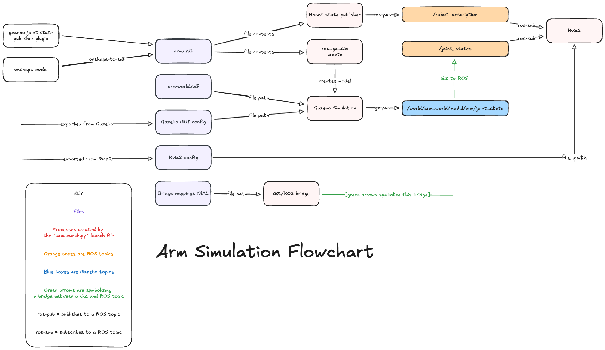

# ROS workspace breakdown

> [!NOTE]
> This workspace was based on an official Gazebo ROS workspace template. You can find the template [here](https://github.com/gazebosim/ros_gz_project_template). You can find the documentation and guide for the template [here](https://gazebosim.org/docs/latest/ros_gz_project_template_guide/).

## Package structure

Every directory containing the `package.xml` file in this workspace is a package for ROS. The `xml` file hold information about the package, and it's dependencies. It also has a `CMakeList.txt` that contains the installation steps on how to install that package for ROS during the `colcon build` process.

Here is the list of current packages, and their original names as they were named in the template (if any):

- `gazebo_code`: Originally `ros_gz_example_gazebo` for gazebo specific configurations and code
- `launch_files`: Originally `ros_gz_example_bringup` for ROS Python launch files
- `models_and_worlds`: Originally `ros_gz_example_description` for `stl` 3D source models, `urdf` files and `sdf` model/world files
- `ros_configs`: Originally `ros_gz_example_application` which holds ROS specific code and configurations for custom plugins or general ROS2 code

## Flowchart

Here is a small flowchart to show how this simulation functions. This one is specific to the robot arm simulation as it is the only model we are simulating at the moment:



## Issues and important build details

While I was working on this there were a few things I noticed that were important to keep in mind as you work on this.

When you build the project or add packages, make sure to update the `package.xml` and `CMakeLists.txt` In each of the respective folders. Each package needs these in their code to be included in the build. These signal to the colcon build system that a package has been added or modified. Additionally in the XML make sure to properly include the dependencies so colcon can properly build the packages in their required order.

---

## Aditional information & development notes

### How to set/read camera info using CLI commands

To set camera position use this format of command:

```bash
gz service -s /gui/move_to/pose --reqtype gz.msgs.GUICamera --reptype gz.msgs.Boolean --timeout 2000 --req "pose: {position: {x: 0.0, y: -2.0, z: 2.0} orientation: {x: -0.2706, y: 0.2706, z: 0.6533, w: 0.6533}}"
```

To read camera position use this topic listener:

```bash
gz topic -e -t /gui/camera/pose
```
